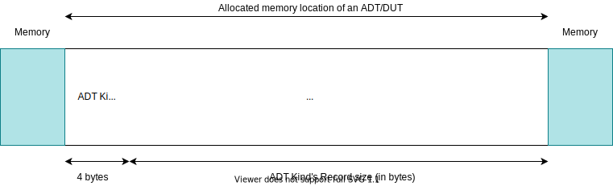
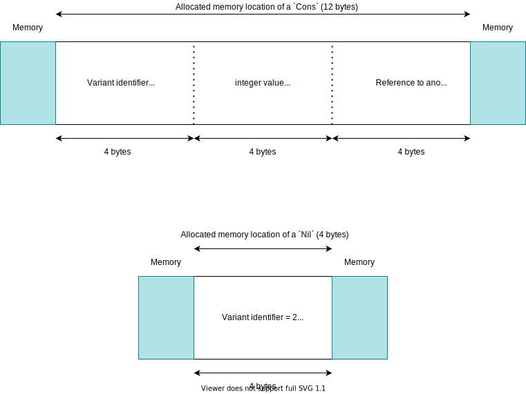

# Memory

All disjoint union types in P0 are allocated in heap memory. As such, all global and local variables are references to specific locations in memory. When assigning these variables, we are only changing the location in memory to which they point. When altering these variables however, we need to calculate the offsets of the variables being modified, add it to the pointer, and then store it into the memory location.

The first 4 bytes of all P0 programs are now intentionally left empty. This is to allow for all uninitialized ADT variables to be "normally" pointing to them when created. When these variables are referenced, they will always see `kind identifier = 0`. By leaving this as such, we may check if ADTs/expected ADTs are uninitialized when `case`-ing on them.

Disjoint union types are allocated by size of the actual kind being instantiation. For example if we had a type `type Maybe = Just(value: integer) | Nothing`, if we were allocating a `Just(10)`, we would be allocating a `Just` variant with a record `(10)` resulting in a total allocation size of 8 bytes (4 for the kind identifier [i32], and 4 for the integer `value` [i32]). However, if we were allocating a `Nothing`, the total memory size would be 4 bytes (only for the kind identifier code).

ADT Kind records are allocated similarly to existing P0 records with values being consecutively placed next to each other, in order it was defined, with integers being 4 bytes, and booleans being 1 byte. To get the offset of any of the variables of any of the kinds, you should calculate the sum of all of the sizes of the variables before it plus 4 bytes for the kind identifier (`offset(Xn) = 4 + sum(size(X₁), ..., size(Xn₋₁))`).

<div><span style="float:right"></span></div>

Once allocated, disjoint union types may not be "freed" to memory (yet). However, allocated disjoint union types are mutable, except for their variant/kind which may not be changed -- only the fields of their record may be mutated. In this sense, we have a tradeoff between memory consumption and functionality of being able to mutate the kind of an allocated disjoint union type variant. If we wanted functionality of being able to change the kind of a disjoint union type, we would need to pre-allocate the size of the largest variant belonging to the parent disjoint union type.

## An Example
```
type List = Cons(head: integer, tail: List)
          | Nil
```

Recalling our standard `List` disjoint union type (above), we may model how memory will be allocated for our `List` variants `Cons` and `Nil`.

Specifically, we would like to note that the size of the variants are dynamic, being based on the record held internally. As per below, the `Cons` variants require 12 bytes of memory while the `Nil` variant requires only 4 bytes. This is because `Nil` contains no record values while the `Cons` construction contains an integer and a reference to another list (which are held internally as WebAssembly `i32`s).

<div><span style="float:right"></span></div>

