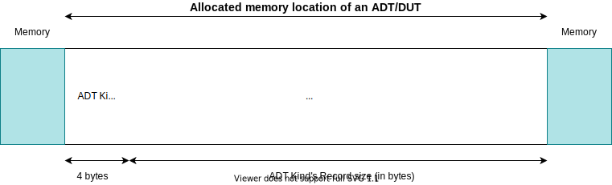

# Memory

All disjoint union types in P0 are allocated in heap memory. As such, all global and local variables are references to specific locations in memory.

The first 4 bytes of all P0 programs are now intentionally left empty. This is to allow for all uninitialized ADT variables to be "normally" pointing to them when created. When these variables are referenced, they will always see `kind identifier = 0`. By leaving this as such, we may check if ADTs/expected ADTs are uninitialized when `case`-ing on them.

Disjoint union types are allocated by size of the actual kind being instantiation. For example if we had a type `type Maybe = Just(value: integer) | Nothing`, if we were allocating a `Just(10)`, we would be allocating a `Just` variant with a record `(10)` resulting in a total allocation size of 8 bytes (4 for the kind identifier [i32], and 4 for the integer `value` [i32]). However, if we were allocating a `Nothing`, the total memory size would be 4 bytes (only for the kind identifier code).

ADT Kind records are allocated similarly to existing P0 records with values being consecutively placed next to each other, in order it was defined, with integers being 4 bytes, and booleans being 1 byte.

Once allocated, disjoint union types may not be "freed" to memory (yet). However, allocated disjoint union types are mutable, except for their variant/kind which may not be changed -- only the fields of their record may be mutated. In this sense, we have a tradeoff between memory consumption and functionality of being able to mutate the kind of an allocated disjoint union type variant. If we wanted functionality of being able to change the kind of a disjoint union type, we would need to pre-allocate the size of the largest variant belonging to the parent disjoint union type.
