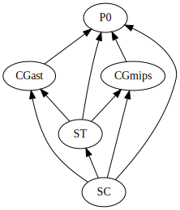

### Modularization

- The parser, `P0`, parses the source text, type-checks it, evaluates constant expressions, and generates target code, in one pass over the source text.
- The scanner, `SC`, reads characters of the source text and provides the next symbol to the parser; it allows errors to be reported at the current position in the source text.
- The symbol table, `ST`, stores all currently valid declarations, as needed for type-checking.
- The code generator, `CGwat`, provides the parser with procedures for generating code for P0 expressions, statements, and variable declarations, and procedure declarations.
- `Runtimes` contains a basic set of utilities for executing P0 programs using `pywasm` or `wasmer` as execution engines.
- `Compiler` handles command-line usage of the compiler suite.
- `tests/` contains a list of testing stubs.
- `examples/` contains a list of example programs making use of Disjoint Union Types.

The parser is the main program that calls the scanner, symbol table, and code generator. All call the scanner for error reporting. The code generator augments the entries in the the symbol table, for example with the size and location of variables. There is one target code generator, `CGwat`, which generates WebAssembly code.

<a style="float:left" href="P0.md">\<\< P0 General Information</a> <a style="float:right" href="DISJOINT_UNION_TYPES.md">Disjoint Union Types \>\></a>
